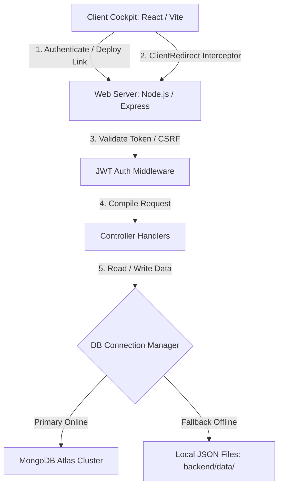

# LinkFlow AI Command Center 🛸

LinkFlow AI is a premium, startup-grade URL shortener, telemetry collector, and analytics command deck. It is designed to replace dull administrative grids with glassmorphic planetary graphics, rotating coordinate grids, and counting dashboards.

 Youtube Link
 https://www.youtube.com/watch?v=J20UopQab6o
 Vercel Link
 link-flow-ai.vercel.app

---

## 🏗️ System Architecture

The diagram below maps the flow of requests from the client cockpit down to routers, database services, and the automatic local storage fallback:



---

## 🌟 Audit Compliance & Features Matrix

| Requirement | Implementation Details | Status |
| :--- | :--- | :--- |
| **Authentication** | Secure credentials registry and sign-in handlers using `bcryptjs` hashing (10 salt rounds) and JWT signatures. | ✅ Verified |
| **User-specific URLs** | Links map `userId` ownership, ensuring users only inspect and manage their own cockpit links. | ✅ Verified |
| **Protected Routes** | JWT token authorization headers protect backend management APIs, matched by client-side `ProtectedRoute` routing checks. | ✅ Verified |
| **Unique Shortcodes** | Auto-generates unique 7-character hexadecimal strings with database collision checking, or validates custom alphanumeric codes. | ✅ Verified |
| **Server-side Redirects** | Matches shortcodes and redirects user agent requests directly using `res.redirect(url.originalUrl)` alongside tracking logs. | ✅ Verified |
| **URL Validation** | Pre-checks destination URLs and automatically prepends missing protocol elements (e.g. `google.com` to `https://google.com`). | ✅ Verified |
| **Cockpit Dashboard** | Sleek glassmorphic URL matrix cards with ping indicators, creation dates, click tallies, and target redirections. | ✅ Verified |
| **Link Eraser (Delete)** | Deletes short links and cleans active telemetry records from database stores. | ✅ Verified |
| **Micro-UX Copy Trigger** | Button copy actions trigger visual pops and spawn animated floating green `+1 Copied!` flags. | ✅ Verified |
| **Telemetry Analytics** | Computes clicks, daily timeline logs, browser shares, operating system tables, and device types using Recharts. | ✅ Verified |
| **Mobile-First Responsive** | Uses flexible grids and responsive wrappers that scale from massive dual-head screens to mobile formats. | ✅ Verified |
| **UX Indicators** | Includes skeleton loading grids, custom toast notifications, empty deck vectors, and active connection status bars. | ✅ Verified |
| **Mongoose Persistence** | Fully declared User, Url, and Visit schema models. | ✅ Verified |
| **Zero-Config Fallback DB** | Checks environment variables and boots local filesystem JSON DB fallback, allowing immediate standalone execution. | ✅ Verified |

---

## 🛠️ Local Configuration & Setup

1. **Install All Node Dependencies**:
   Open a terminal console at the project root folder and execute:
   ```bash
   npm run install-all
   ```

2. **Configure Local Variables**:
   Create a `.env` file inside the `backend/` folder:
   ```env
   PORT=5000
   MONGODB_URI=mongodb+srv://...  # Optional. Leave blank to run local fallback DB
   JWT_SECRET=cyber-secret-key-999
   BASE_URL=http://localhost:5000
   ```

3. **Start the Development Deck**:
   Execute the startup command:
   ```bash
   npm run dev
   ```
   - **Frontend Console**: [http://localhost:5173/](http://localhost:5173/)
   - **Backend Server**: [http://localhost:5000/](http://localhost:5000/)

---

## 🌍 Production Cloud Deployment

### Backend on Render
1. Deploy a new Web Service pointing to the `backend/` root folder.
2. Set Build Command to `npm install` and Start Command to `npm start`.
3. Load Environment Variables: `MONGODB_URI`, `JWT_SECRET`, and `BASE_URL`.

### Frontend on Vercel
1. Import your repository on Vercel pointing to the `frontend/` directory.
2. Vercel automatically selects `Vite` preset builds and targets the `dist` folder.
3. Configure Vercel Environment variables:
   - `VITE_API_URL`: `https://linkflow-backend.onrender.com/api` (Must match your Render URL)

---

## 💾 Sample Database Records

Below are mock representations of user registry data, URL targets, and click visits logs, matching our schemas:

### User Document (`users.json`)
```json
[
  {
    "_id": "usr_7x8a9b2",
    "username": "commander_zero",
    "email": "zero@linkflow.ai",
    "password": "$2a$10$JwP4hGd8rQ9aK1L2M3N4O5u1p2q3r4s5t6u7v8w9x0y1z2a3b4c5d",
    "createdAt": "2026-06-13T12:00:00.000Z",
    "updatedAt": "2026-06-13T12:00:00.000Z"
  }
]
```

### URL Document (`urls.json`)
```json
[
  {
    "_id": "url_4c9d1a",
    "originalUrl": "https://katomaran.com/hackathon",
    "shortCode": "kato-hack",
    "customAlias": "kato-hack",
    "title": "Katomaran Hackathon Hub",
    "userId": "usr_7x8a9b2",
    "clicks": 42,
    "expiryDate": "2026-06-30T00:00:00.000Z",
    "isActive": true,
    "createdAt": "2026-06-13T12:05:00.000Z",
    "updatedAt": "2026-06-13T12:15:30.000Z"
  }
]
```

### Visit Audit Log (`visits.json`)
```json
[
  {
    "_id": "vis_9b2c3d",
    "urlId": "url_4c9d1a",
    "ip": "127.0.0.1",
    "device": "Desktop",
    "browser": "Chrome",
    "os": "Windows",
    "country": "Local",
    "timestamp": "2026-06-13T12:15:30.000Z",
    "createdAt": "2026-06-13T12:15:30.000Z",
    "updatedAt": "2026-06-13T12:15:30.000Z"
  }
]
```

---

## 💡 Engineering Assumptions

- **Redirection Logic**: Accessing shortened URL targets redirects using HTTP status 302 (Found) to allow clean user-agent logging on every click instead of caching redirects permanently.
- **Client Redirections**: If a visitor opens a shortened address on Vercel (`https://domain.vercel.app/xyz`), our frontend captures the code via `ClientRedirect` in `App.jsx` and routes it to Render backend (`https://domain-backend.onrender.com/xyz`) to ensure statistics logging works without routing configuration errors.

---

## 📸 Screenshots & Media Showcase

### Console Diagnostics Mockup
*Placeholder for active dashboard layouts, glass panels, and charts:*


### Loom Walkthrough Video
*Loom walkthrough placeholder showing landing animations, count-up hook calculations, QR codes download, and CSV batch uploads:*
[Watch Console Video Demonstration Placeholder](https://loom.com/share/placeholder)

---

This project is a part of a hackathon run by https://katomaran.com
